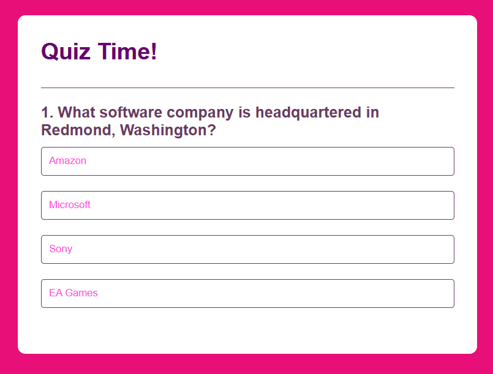
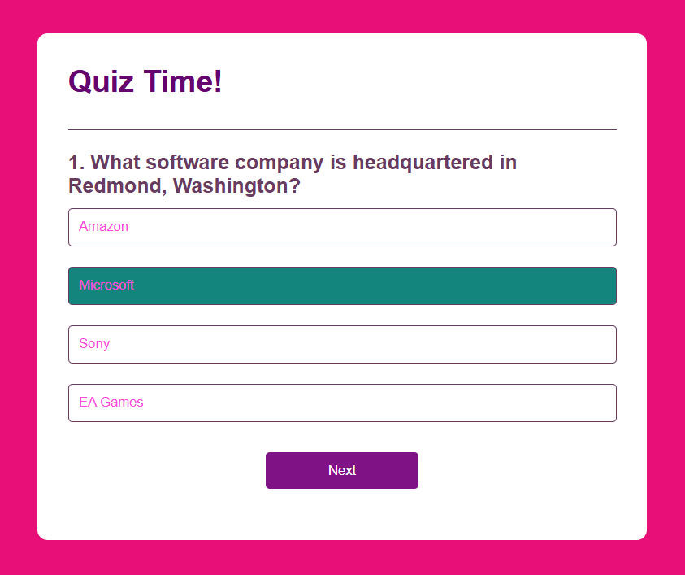
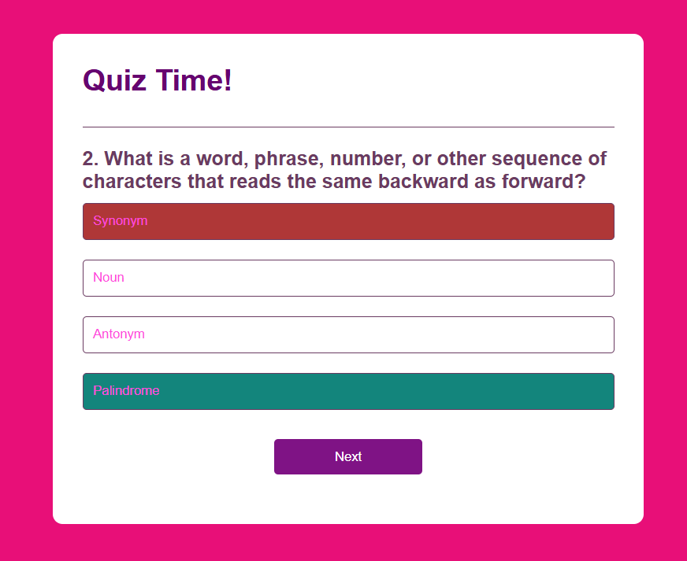
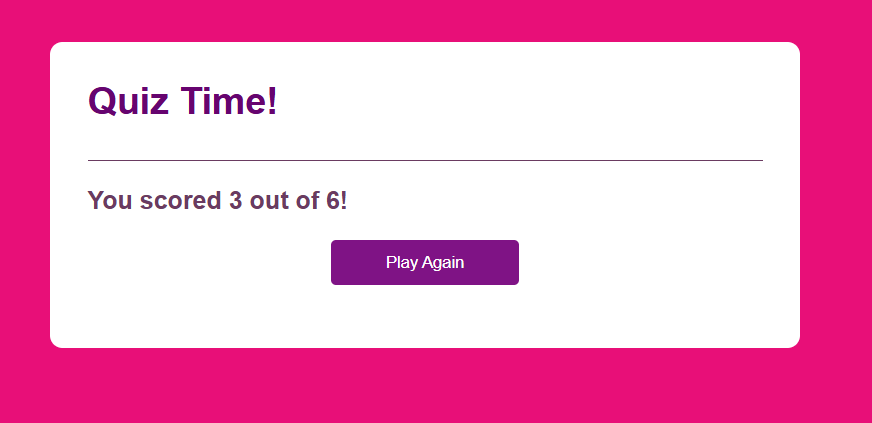

# Quiz App  

A simple, interactive JavaScript Quiz Application that allows users to test their knowledge through multiple‑choice questions.  
This project is designed for beginners and learners who want a clean, responsive quiz interface that tracks progress and displays results instantly.

Live Demo: *(Add your GitHub Pages link here)*  
Frontend Repo: [https://github.com/STEM-Girlie/Quiz-App](https://github.com/STEM-Girlie/Quiz-App)  
Backend Repo: *(Not applicable — this is a frontend‑only project)*  

## Table of Contents

- [Overview](#overview)
- [Features](#features)
- [Tech Stack](#tech-stack)
- [Architecture](#architecture)
- [Database Design](#database-design)
- [API Endpoints](#api-endpoints)
- [Installation](#installation)
- [Environment Variables](#environment-variables)
- [Usage](#usage)
- [Screenshots](#screenshots)
- [Deployment](#deployment)
- [Future Improvements](#future-improvements)
- [Credits](#credits)
- [License](#license)

## Overview

### Motivation
This project was built to strengthen core JavaScript skills, especially DOM manipulation, event handling, and dynamic UI updates.  
It also serves as a portfolio piece demonstrating your ability to build interactive front‑end applications.

### Objective
To create a lightweight quiz interface that presents questions, tracks user answers, calculates scores, and displays results in a clean, user‑friendly layout.

### Learning Outcomes
- Built a dynamic quiz interface using JavaScript  
- Practiced DOM manipulation and event listeners  
- Implemented question progression and scoring logic  
- Designed a responsive UI with HTML & CSS  
- Deployed a static front‑end application  

## Features

- Multiple‑choice quiz questions  
- Dynamic question loading  
- Score calculation  
- Progress tracking  
- Responsive design  
- Restart quiz functionality  

## Tech Stack

### Frontend
- HTML5  
- CSS3  
- JavaScript (Vanilla)

### Backend
*(Not applicable — this is a frontend‑only project)*

### Database
*(Not applicable — no database used)*

### Tools
- Git & GitHub  
- VS Code  
- GitHub Pages (Deployment)

## Architecture

Client (Browser)  
↓  
JavaScript Logic (Questions, Scoring, UI Updates)  
↓  
Rendered Quiz Interface  

### Folder Structure Example:
```
Quiz-App/
 ├── index.html
 ├── style.css
 ├── script.js
 └── assets/
```
 
## Database Design

This project does not use a database.  
All quiz questions are stored directly in JavaScript as an array of objects.

## API Endpoints

This project does not currently include a backend or API.

## Installation

### Clone the Repository

```bash
git clone https://github.com/STEM-Girlie/Quiz-App.git
cd Quiz-App
```

No dependencies are required — this is a pure front‑end project.

## Usage

1. Open `index.html` in your browser  
2. Click **Start** to begin the quiz  
3. Select an answer for each question  
4. View your score at the end  
5. Restart the quiz to try again  

## Screenshots

```
assets/
 ├── home.png
 ├── question.png
 └── results.png
```








## Deployment

To deploy using GitHub Pages:

1. Go to **Settings** → **Pages**  
2. Select branch: `main`  
3. Folder: `/root`  
4. Save  

Your quiz will be live in seconds.

## Future Improvements

- Add a timer for each question
- Using a Trivia API (like Open Trivia DB)
- Refactoring the quiz into a Cloud‑Learning Quiz
- Add categories or difficulty levels  
- Add sound effects or animations  
- Add a backend to store high scores  
- Add more question sets  

## Credits

Developer: **Nasreen Baker**  
GitHub: `https://github.com/STEM-Girlie` [(github.com in Bing)](https://www.bing.com/search?q="https%3A%2F%2Fgithub.com%2FSTEM-Girlie")  

## License

This project is licensed under the MIT License.
